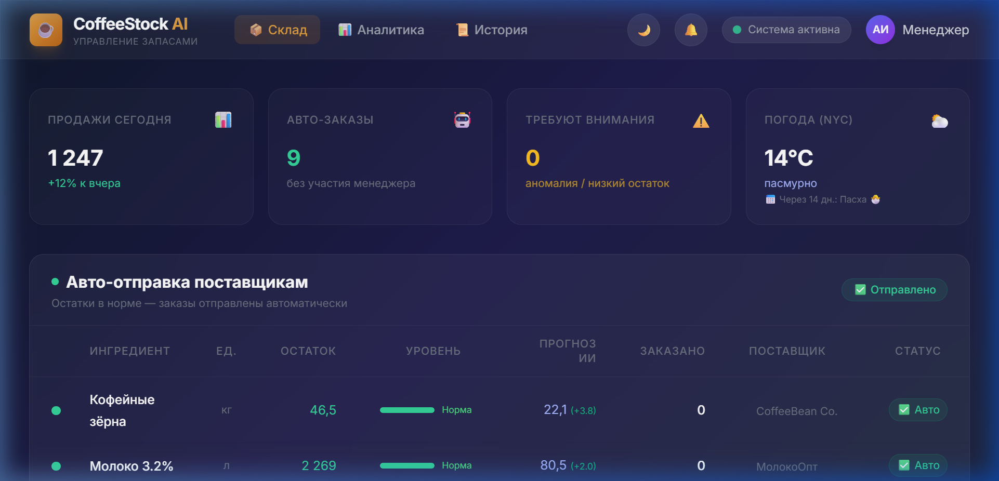
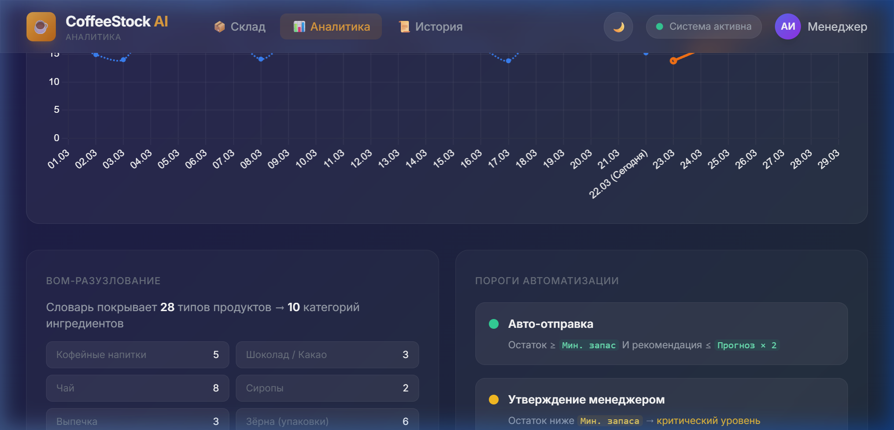
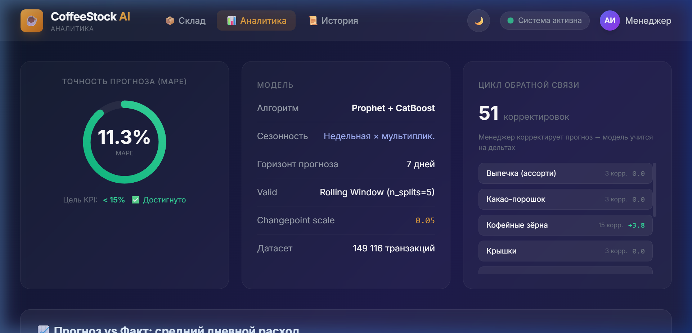
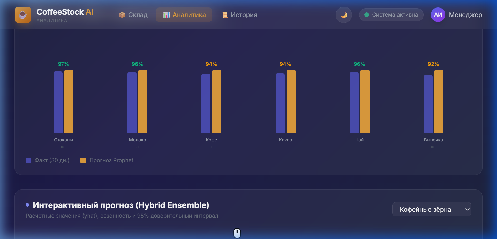
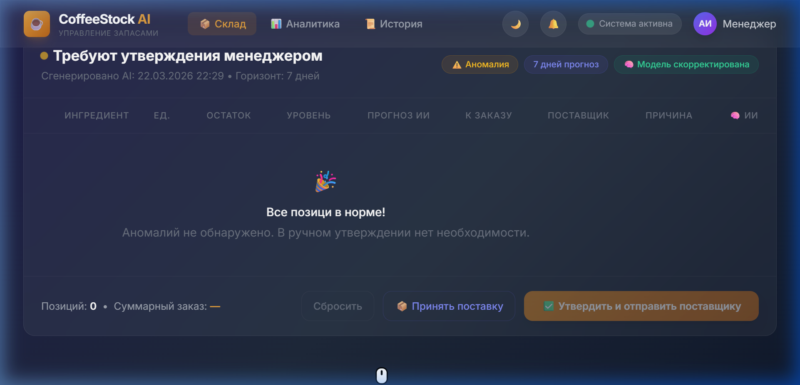
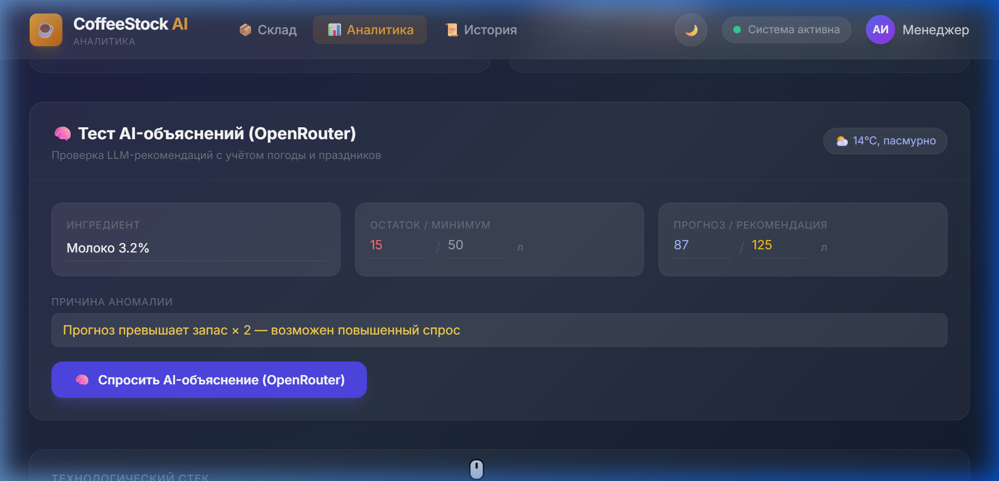

<div align="center">
  <h1>☕ CoffeeStock AI</h1>
  <p><strong>Интеллектуальная система управления запасами для сети кофеен</strong><br>
  <em>(Курсовой проект РИС-23-3)</em></p>
  
  <p>
    
    
    
    
  </p>
</div>

<br>



## 📌 О проекте

**CoffeeStock AI** — это легковесная ERP-система для автоматизации закупок сырья (ингредиентов) в сети кофеен. Система решает проблему дефицита и профицита складов, заменяя ручной труд менеджера по закупкам на ML-прогнозирование.

Система агрегирует исторические данные из POS-терминалов, обогащает их внешними метеоданными (API погоды) и генерирует прогноз продаж на горизонт 7 дней с помощью алгоритма временных рядов **Meta Prophet**. После этого происходит BOM-разузлование (перевод готовых чашек в граммы/миллилитры ингредиентов) и автоматическая отправка заказов поставщикам.



## ⚙️ Функционал

1. **Автоматическое прогнозирование спроса:**
   - ML-движок на базе Prophet + Weather Regressors (дождь, температура)
   - Конвертация POS-чеков в расход ингредиентов через BOM
   - WMAPE точность прогноза: **10.9%** (при KPI < 15%)
2. **AI-Ассистент (LLM):**
   - Интеграция с OpenRouter для объяснения аномалий в спросе натуральным языком
3. **Защищенный API (M1 Module):**
   - Эндпоинт `/api/v1/pos/sync` для приема данных от касс
   - Rate Limiting (slowapi): защита от DDoS и перегрузок
4. **Умный интерфейс менеджера (Frontend):**
   - SPA приложение на Vanilla JS + HTML + TailwindCSS
   - Интерактивные графики Chart.js (Прогноз vs Факт)
   - Механизм Human-in-the-Loop (цикл обратной связи)

## 📸 Скриншоты системы

<details>
<summary><b>1. Dashboard: Аналитика и Склад (нажмите чтобы развернуть)</b></summary>
<br>


</details>

<details>
<summary><b>2. Модуль Утверждения Заказов + AI (нажмите чтобы развернуть)</b></summary>
<br>


</details>

## 🚀 Установка и Запуск локально

1. **Клонирование репозитория:**
   ```bash
   git clone https://github.com/JayceWright/CoffeeStockAI.git
   cd CoffeeStockAI
   ```

2. **Загрузка зависимостей:**
   ```bash
   python -m venv venv
   # Выполните активацию под вашу ОС
   pip install -r requirements.txt
   ```

3. **Запуск ML-модели (опционально, обучает Prophet на новых данных):**
   ```bash
   python ml/forecast.py
   ```

4. **Запуск сервера FastAPI:**
   ```bash
   uvicorn app.main:app --reload --port 8000
   ```
   Откройте `http://localhost:8000` в браузере.

## 🛠 Технологический стек

- **Backend:** Python, FastAPI, SQLAlchemy
- **Database:** PostgreSQL (на бою), SQLite (локально)
- **ML & Data:** Pandas, Prophet (Meta), Open-Meteo
- **Frontend:** HTML, TailwindCSS (CDN), JS
- **Infrastucture:** Railway Deploy, slowapi (Rate Limiter)

## 📄 Справочник администратора
Для детального погружения в архитектуру и разворачивание читайте полноценное [Руководство администратора](admin_guide.md) в корневом каталоге.
